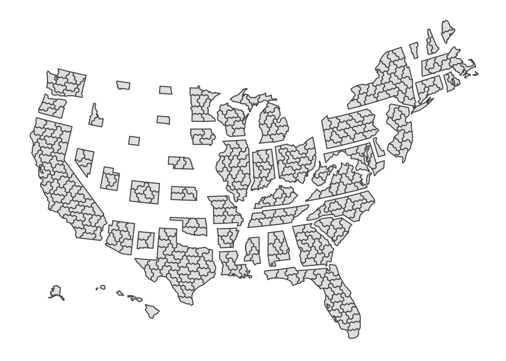
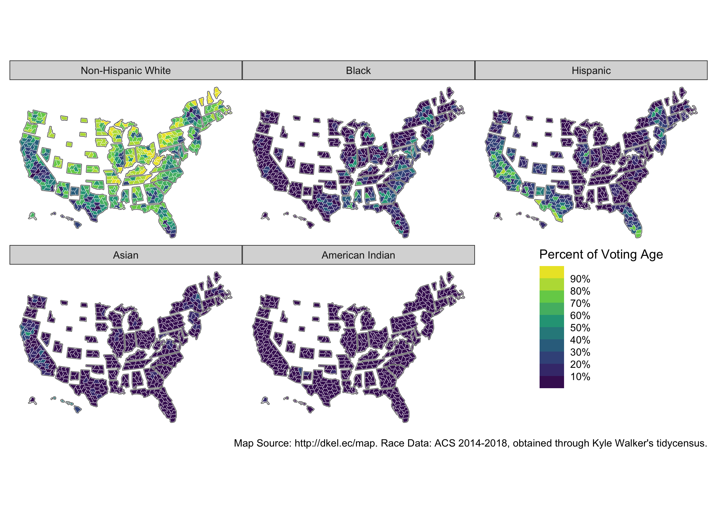

<!-- README.md is generated from README.Rmd. Please edit that file -->

# donnermap

<!-- badges: start -->
<!-- badges: end -->

The goal of donnermap is to …

And the development version from [GitHub](https://github.com/) with:

``` r
# install.packages("devtools")
devtools::install_github("kuriwaki/donner-map")
```

## Example

``` r
library(donnermap)

# For graphing
library(ggplot2)
library(sf)
#> Linking to GEOS 3.8.1, GDAL 3.1.4, PROJ 6.3.1
library(ggthemes)
library(dplyr)
#> 
#> Attaching package: 'dplyr'
#> The following objects are masked from 'package:stats':
#> 
#>     filter, lag
#> The following objects are masked from 'package:base':
#> 
#>     intersect, setdiff, setequal, union
library(scales)
```

``` r
ggplot(cd_shp) + geom_sf() + theme_map()
```



Joining a shape file to a dataframe (but not the reverse) will append
the data. Since the race data here is in long form, the joined dataframe
will be in long-form as well.

``` r
cd_race <- left_join(cd_shp, race_by_cd, by = "cd")

# plot
ggplot(cd_race) +
  geom_sf(data = st_shp, fill = "transparent", size = 0.5) +
  geom_sf(aes(fill = frac), size = 0.1, color = "white") +
  scale_fill_viridis_b(
    "Percent of Voting Age", 
    na.value = "white", 
    breaks = seq(0, 1, 0.1), 
    labels = percent_format(accuracy = 1)) +
  facet_wrap(~ race) +
  theme_map() +
  labs(caption = "Map Source: http://dkel.ec/map. Race Data: ACS 2018, obtained through tidycensus. Blank CDs are locations where ACS did not report due to small samples.") +
  theme(legend.position = c(0.75, 0.1))
```


